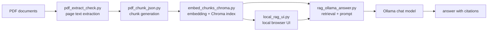
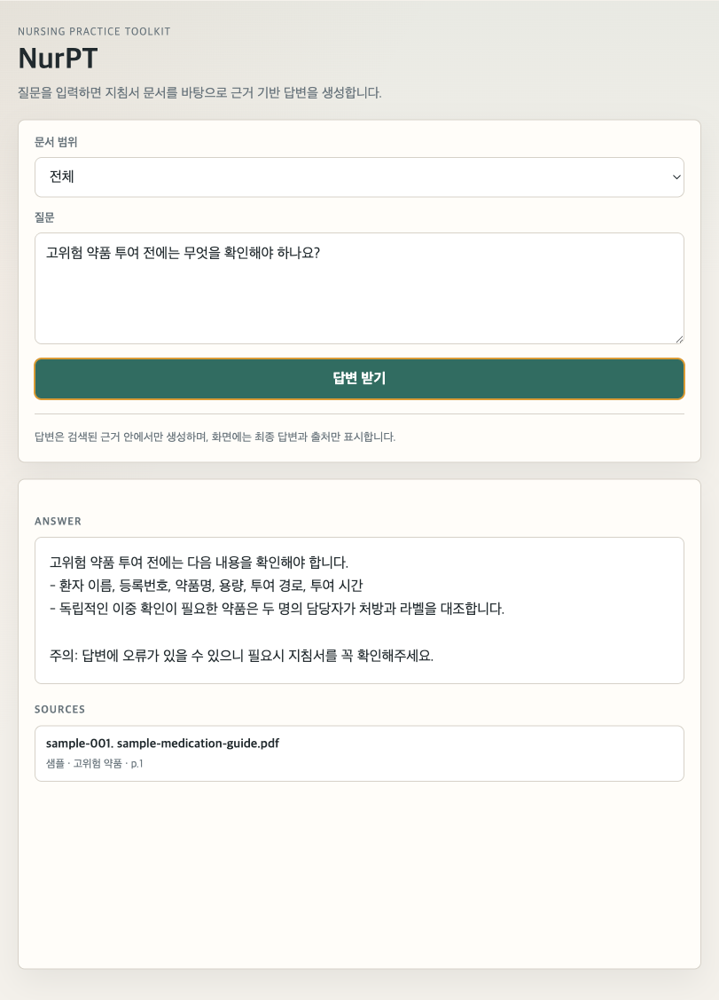

# NurPT Local RAG

NurPT는 PDF 기반 업무 지침서를 전처리하고, 문서 청크를 임베딩해 ChromaDB에 색인한 뒤, 사용자의 자연어 질문에 대해 관련 근거를 검색하고 로컬 LLM으로 답변을 생성하는 RAG 기반 지식 검색 프로젝트입니다.

이 저장소는 포트폴리오 제출용으로 정리된 버전입니다. 실제 원문 PDF, 추출 텍스트, ChromaDB 색인 파일은 저작권과 보안 이슈를 피하기 위해 포함하지 않습니다.

## Why

정보 밀도가 높고 상황 변화가 빠른 간호사의 업무 환경 속에서, 방대한 업무 지침서는 필요한 내용을 빠르게 찾기 어렵고, 검색어를 정확히 모르면 관련 문서를 놓치기 쉽습니다. NurPT는 실무자가 자연어로 질문하면 관련 문서 조각을 먼저 찾고, LLM이 검색된 근거 안에서만 짧게 답하도록 설계했습니다.

초기에는 문서 탐색기 기능과 LLM 답변 기능을 함께 검토했지만, 임상 현장의 시간 제약을 고려해 사용자가 질문하면 바로 근거 기반 답변을 받을 수 있는 흐름에 집중했습니다.

## Features

- PDF 페이지별 텍스트 추출 및 품질 점검
- 문단 중심 chunking과 긴 문단 분할
- Ollama embedding 모델 기반 벡터화
- ChromaDB 영속 저장소 색인
- 카테고리, 권, 문서명, 페이지 메타데이터 관리
- 벡터 검색과 키워드 보강 검색
  - 문서 제목 가중치 반영
  - 임상 용어 그룹 기반 쿼리 확장
  - 카테고리/섹션/문서 단위 메타데이터 필터링
- 검색 근거 기반 LLM 답변 생성
- 로컬 웹 UI로 검색/답변 테스트
- RAG smoke test 질문 세트와 품질 점검 기준

## Architecture



## Demo Screenshot

아래 화면은 실제 원문이 아닌 `sample_data/` 기반 더미 데이터로 실행한 데모입니다.



## Tech Stack

- Python 3.10+
- PyMuPDF
- ChromaDB
- Ollama
- Embedding model: `qwen3-embedding:8b`
- Chat model: `qwen3.5:9b`
- Local HTTP UI with Python standard library

## Setup

```bash
python3 -m venv .venv
source .venv/bin/activate
pip install -r requirements.txt
```

Ollama가 로컬에서 실행 중이어야 합니다.

```bash
ollama pull qwen3-embedding:8b
ollama pull qwen3.5:9b
```

## Quick Demo With Sample Data

포트폴리오 공개본에는 실제 원문 대신 더미 청크가 들어 있습니다. `sample_data/`의 내용은 실제 지침서에서 발췌한 문장이 아니라, RAG 파이프라인 재현을 위해 작성한 가상의 샘플 데이터입니다. 아래 명령으로 샘플 색인을 만들 수 있습니다.

```bash
python3 embed_chunks_chroma.py index \
  --input sample_data/sample_chunks.json \
  --db-path sample_chroma_db \
  --collection sample_pdf_chunks
```

검색만 확인하려면:

```bash
python3 embed_chunks_chroma.py search "고위험 약품 투여 전에는 무엇을 확인해야 하나요?" \
  --db-path sample_chroma_db \
  --collection sample_pdf_chunks \
  --top-k 3
```

LLM 답변까지 확인하려면:

```bash
python3 rag_ollama_answer.py "고위험 약품 투여 전에는 무엇을 확인해야 하나요?" \
  --db-path sample_chroma_db \
  --collection sample_pdf_chunks
```

로컬 UI:

```bash
python3 local_rag_ui.py --db-path sample_chroma_db --collection sample_pdf_chunks
```

브라우저에서 `http://127.0.0.1:8765`로 접속합니다.

## Main Scripts

- `pdf_extract_check.py`: PDF를 페이지별 텍스트 JSON과 TXT로 추출합니다.
- `pdf_chunk_json.py`: 추출 JSON을 RAG 색인에 적합한 청크 JSON으로 변환합니다.
- `embed_chunks_chroma.py`: 청크를 임베딩하고 ChromaDB에 저장하거나 검색합니다.
- `rag_ollama_answer.py`: 검색된 근거를 바탕으로 LLM 답변을 생성합니다.
- `local_rag_ui.py`: 로컬 웹 UI를 제공합니다.
- `reindex_with_categories.py`: 여러 문서를 카테고리 메타데이터와 함께 재색인합니다.

## Security And Data Policy

이 프로젝트는 원문 문서와 생성된 색인 DB를 공개 저장소에 포함하지 않는 것을 전제로 합니다.

- 원문 PDF는 커밋하지 않습니다.
- 추출 JSON/TXT와 chunk JSON은 원문 복원 가능성이 있어 커밋하지 않습니다.
- ChromaDB 파일과 백업 DB는 커밋하지 않습니다.
- README와 데모는 더미 데이터만 사용합니다.
- `sample_data/`는 실제 원문 발췌가 아닌 가상 샘플 데이터만 포함합니다.
- 실제 도메인 데이터로 실행한 결과를 캡처할 때도 문서 본문이 노출되지 않도록 가립니다.

자세한 제출 전 점검 항목은 `SECURITY_CHECKLIST.md`를 확인하세요.

## Demo Scenario

제출용 시연 흐름은 `docs/demo_scenario.md`에 정리했습니다.

## Portfolio Summary

NurPT는 로컬 환경에서 동작하는 RAG 기반 지식 검색 시스템입니다. PDF 지침서에서 텍스트를 추출하고, 문서 조각을 임베딩해 ChromaDB에 저장하며, 사용자의 질문에 대해 관련 근거를 찾아 LLM이 답변하도록 구성했습니다. 단순한 LLM API 호출이 아니라 문서 전처리, 검색 품질 개선, 메타데이터 설계, 근거 기반 답변 형식까지 다룬 AI 개발 프로젝트입니다.
